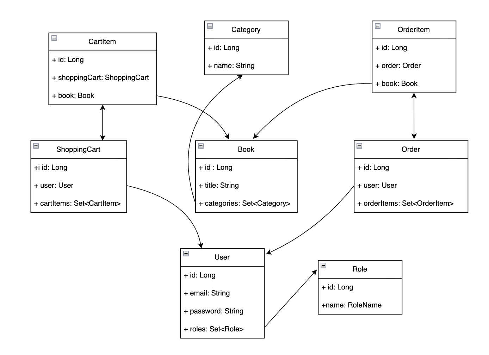

# 📚 Bookstore API

## Introduction
Bookstore is a Java Spring Boot REST API for managing an online bookstore.  
It supports core e-commerce features such as managing books, categories, users, shopping carts, and orders.  
The project uses MySQL for data storage and Liquibase for database migrations.  
It can be run either via Maven or using Docker Compose for containerized deployment.

---

## Table of Contents
- [Features](#features) 
- [Database Model](#database-model) 
- [Tech Stack](#tech-stack)  
- [Installation](#installation)  
  - [Run with Docker Compose](#run-with-docker-compose)  
  - [Run with Maven](#run-with-maven)  
- [Configuration](#configuration)  
- [Usage](#usage)  
- [API Documentation](#api-documentation)  
- [Postman Collection](#postman-collection)  
- [Database Migrations](#database-migrations)  
- [Testing](#testing)  
- [Troubleshooting](#troubleshooting)  
- [Contributors](#contributors)

---

## Features
- 📖 Manage books (CRUD)  
- 🏷️ Manage categories  
- 👤 User authentication with JWT  
- 🛒 Shopping cart operations  
- 📦 Order creation & tracking  
- 🔐 Role-based access control  
- 🗄️ Database versioning with Liquibase  
- 🐳 Containerized with Docker & Docker Compose 

---

## Database Model
Here is a diagram of the application's data model:



---

## Tech Stack
- **Backend:** Java 17, Spring Boot 3.5.3 
- **Build Tool:** Maven 3.3.0
- **Database:** MySQL 8.4.0
- **Database Migration:** Liquibase 4.33.0
- **Authentication:** JWT (JSON Web Tokens)  
- **Containerization:** Docker, Docker Compose  
- **Code Quality:** Checkstyle 3.3.0
- **Additional Libraries:** Lombok 1.18.38, MapStruct 1.6.3, Testcontainers 1.21.3, jjwt 0.12.7

---

## Installation

### Run with Docker Compose
1. Clone the repository:
   ```bash
   git clone https://github.com/DariaBakal/bookstore-api
   ```
2. Navigate into the project directory:
   ```bash
   cd bookstore-api
   ```
3. Copy the environment template:
   ```bash
   cp .env.template .env
   ```
4. Update `.env` with your configuration (DB credentials, ports, etc.).
5. Build and run:
   ```bash
   docker-compose up --build
   ```
6. The API will be available at:  
   👉 [http://localhost:8080](http://localhost:8080)

---

### Run with Maven
1. Ensure MySQL is running and configured.
2. Update `src/main/resources/application.properties` with your DB credentials.
3. Build the project:
   ```bash
   ./mvnw clean install
   ```
4. Run the application:
   ```bash
   ./mvnw spring-boot:run
   ```

---

## Configuration
* Environment variables are defined in `.env.template` and `.env`.
* Database settings can be adjusted in `application.properties`.
* Liquibase changelogs are located in `src/main/resources/db/changelog/`.

---

## Usage
API endpoints manage:

* Books  
* Categories  
* Users & roles  
* Shopping carts  
* Orders  

**Authentication:**

* The API uses JWT tokens.  
* Register/login to receive a token.  
* Include the token in requests:
   ```http
   Authorization: Bearer <your_token>
   ```

---

## API Documentation
Interactive API documentation is available via Swagger UI:  
👉 [Swagger UI](http://localhost:8088/api/swagger-ui/index.html#/)

---

## API Endpoints Overview

### Authentication Management
Endpoints for managing user authentication:

- **POST /auth/registration** – Register a new user  
- **POST /auth/login** – Login an existing user

---

### Category Management
Endpoints for managing categories:

- **GET /categories** – Get all categories  
- **GET /categories/{id}** – Get category by ID  
- **POST /categories** – Create a new category  
- **PUT /categories/{id}** – Update an existing category  
- **DELETE /categories/{id}** – Delete category by ID  
- **GET /categories/{id}/books** – Get all books in a category

---

### Order Management
Endpoints for managing orders:

- **GET /orders** – Get order history  
- **POST /orders** – Place a new order  
- **PATCH /orders/{orderId}** – Update order status  
- **GET /orders/{orderId}/items** – Get items of an order  
- **GET /orders/{orderId}/items/{itemId}** – Get a specific order item

---

### Shopping Cart Management
Endpoints for managing shopping carts:

- **GET /cart** – Get current shopping cart  
- **POST /cart** – Add a book to the shopping cart  
- **PUT /cart/items/{cartItemId}** – Update book quantity in cart  
- **DELETE /cart/items/{cartItemId}** – Remove a book from cart

---

### Book Management
Endpoints for managing books:

- **GET /books** – Get all books  
- **GET /books/{id}** – Get book by ID  
- **POST /books** – Create a new book  
- **PUT /books/{id}** – Update an existing book  
- **DELETE /books/{id}** – Delete book by ID  
- **GET /books/search** – Search books

---

## Postman Collection
You can also test the API using this Postman collection:  
👉 [Bookstore Postman Collection](https://altimetry-astronomer-58424565-4133510.postman.co/workspace/My-Workspace~522f0a06-eb90-4426-9427-6b35a588f240/collection/47037768-c9879299-da0d-47ba-a8eb-267b477edc0c?action=share&creator=47037768)

---

## Database Migrations
* The project uses Liquibase for schema management.  
* Migrations are located in: `src/main/resources/db/changelog/`

---

## Testing
Run the test suite with:
```bash
./mvnw test
```

---

## Troubleshooting
* **Containers don’t start:**  
  Ensure Docker & Docker Compose are installed and running.  
  Check `.env` values match MySQL connection settings.

* **Maven runs fail:**  
  Ensure MySQL is up and credentials are correct.  
  Run:
  ```bash
  mvn clean install -U
  ```
  to clear cached dependencies.

---

## Contributors
* **Daria Bakal** – Initial development
